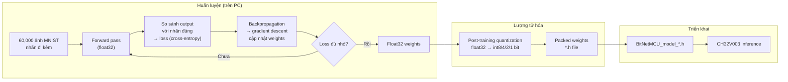

# BitNetMCU — Từ pixel đến dự đoán: Cách mạng nơ-ron chạy trên vi điều khiển

> **Tác giả:** cpldcpu (BitNetMCU gốc), ported to AK-OS
> **Vi điều khiển:** CH32V003 (RISC-V RV32EC, 48 MHz, 2 KB RAM, 16 KB Flash)
> **Tác vụ:** Nhận dạng chữ số viết tay MNIST (10 lớp: 0–9)

---

## Mục lục

1. [Mạng nơ-ron là gì? — Giải thích trực quan](#1-mạng-nơ-ron-là-gì--giải-thích-trực-quan)
2. [Tổng quan pipeline BitNetMCU](#2-tổng-quan-pipeline-bitnetmcu)
3. [Từ ảnh đến số liệu — Input preprocessing](#3-từ-ảnh-đến-số-liệu--input-preprocessing)
4. [Convolutional layer — Bộ phát hiện đặc trưng](#4-convolutional-layer--bộ-phát-hiện-đặc-trưng)
5. [MaxPooling — Tổng hợp và nén](#5-maxpooling--tổng-hợp-và-nén)
6. [ReLU & Normalization — Chuẩn hóa dữ liệu](#6-relu--normalization--chuẩn-hóa-dữ-liệu)
7. [Fully Connected layer — Lá phiếu có trọng số](#7-fully-connected-layer--lá-phiếu-có-trọng-số)
8. [Lượng tử hóa (Quantization) — Nén mô hình xuống vài KB](#8-lượng-tử-hóa-quantization--nén-mô-hình-xuống-vài-kb)
9. [Giải mã trọng số — processfclayer chi tiết](#9-giải-mã-trọng-số--processfclayer-chi-tiết)
10. [Ví dụ cụ thể: Số "7" đi qua mạng](#10-ví-dụ-cụ-thể-số-7-đi-qua-mạng)
11. [Kiến trúc mạng đầy đủ](#11-kiến-trúc-mạng-đầy-đủ)
12. [Tối ưu cho CH32V003 (không hardware MUL)](#12-tối-ưu-cho-ch32v003-không-hardware-mul)
13. [Huấn luyện — Trọng số từ đâu ra?](#13-huấn-luyện--trọng-số-từ-đâu-ra)
14. [Đọc hiểu debug log](#14-đọc-hiểu-debug-log)
15. [Các câu hỏi thường gặp](#15-các-câu-hỏi-thường-gặp)

---

## 1. Mạng nơ-ron là gì? — Giải thích trực quan

### 1.1 Ý tưởng cốt lõi

Mạng nơ-ron là một **hàm toán học cực kỳ phức tạp** được xấp xỉ từ dữ liệu. Nó học cách ánh xạ từ **đầu vào** (pixel ảnh) sang **đầu ra** (nhãn số).

```
input (256 pixel) ──→ [hàm f(·)] ──→ output (10 giá trị, mỗi giá trị là điểm cho một số 0-9)
```

"f" là một chuỗi các phép biến đổi đơn giản (nhân ma trận + ReLU) xếp chồng lên nhau. Xếp càng nhiều, mạng càng "sâu" và học được càng trừu tượng.

### 1.2 So sánh trực quan

Hãy tưởng tượng bạn dạy một đứa trẻ nhận biết số "7":

| Cấp độ | Trẻ em | Mạng nơ-ron |
|--------|--------|-------------|
| Thô | Nhìn chấm sáng/tối trên giấy | Pixel gốc (input) |
| Đơn giản | "Có đường ngang trên, đường dọc bên phải" | Conv layer 1: phát hiện cạnh |
| Tổng hợp | "Vạch ngang nối với vạch dọc" | Conv layer 2: tổ hợp cạnh |
| Trừu tượng | "Đây là số 7" | FC layer: weighted vote |

### 1.3 Từ neuron sinh học đến neuron nhân tạo

```
Neuron sinh học:          Neuron nhân tạo (perceptron):
  Dendrite ──→ Soma ──→ Axon       input[0] × weight[0] ──┐
                                    input[1] × weight[1] ──┤──→ sum ──→ activation ──→ output
                                    input[2] × weight[2] ──┘
```

**Công thức:** `output = activation( Σ (input_i × weight_i) + bias )`

Trong BitNetMCU, `bias = 0` (bỏ qua để tiết kiệm). `activation = ReLU` (giữ số dương, xóa số âm).

---

## 2. Tổng quan pipeline BitNetMCU

```mermaid
flowchart LR
    subgraph Input
        I1["Input 16×16 MNIST<br/>256 int8 values<br/>-128..127"]
    end

    subgraph Conv_Block["Conv Block (Depthwise Separable)"]
        C1["L2: Conv2d 3×3<br/>8-bit weights<br/>16² → 14²<br/>shift=4, ReLU"]
        C2["L4: Conv2d 3×3<br/>8-bit weights<br/>14² → 12²<br/>shift=4, ReLU"]
        C3["L6: MaxPool 2×2<br/>12² → 6²"]
        C4["L7: Conv2d 3×3<br/>8-bit weights<br/>6² → 4²<br/>shift=4, ReLU"]
        C5["L9: MaxPool 2×2<br/>4² → 2²"]
    end

    subgraph Combine["Kết hợp channels"]
        M1["64 channels × 4 values<br/>= 256 int32 activations"]
    end

    subgraph FC_Block["Fully Connected Block"]
        F1["L11: FC 256→96<br/>2-bit ternary weights"]
        F2["L13: FC 96→64<br/>4-bit symmetric weights"]
        F3["L15: FC 64→10<br/>4-bit symmetric weights"]
    end

    subgraph Output
        O1["10 scores → argmax<br/>→ predicted digit"]
    end

    I1 -->|"×64 depthwise"| C1
    C1 --> C2 --> C3 --> C4 --> C5
    C5 -->|"stack channels"| M1
    M1 -->|"ReLUNorm"| F1
    F1 -->|"ReLUNorm"| F2
    F2 -->|"ReLUNorm"| F3
    F3 -->|"ReLUNorm (argmax)"| O1
```



**Pipeline gồm 4 giai đoạn lớn:**

1. **Conv layers** (L2–L9): Trích xuất đặc trưng từ pixel — phát hiện cạnh, góc, đường cong
2. **Combine**: Gộp 64 kênh đặc trưng thành vector 256 phần tử
3. **FC layers** (L11–L15): Tổ hợp đặc trưng → tính điểm cho 10 lớp
4. **Argmax**: Chọn lớp có điểm cao nhất → dự đoán cuối

---

## 3. Từ ảnh đến số liệu — Input preprocessing

### 3.1 MNIST là gì?

MNIST = **Modified National Institute of Standards and Technology** database:
- 60,000 ảnh huấn luyện + 10,000 ảnh kiểm tra
- Mỗi ảnh: chữ số viết tay **28×28 pixel**, **grayscale** (0–255)
- 10 lớp: 0, 1, 2, 3, 4, 5, 6, 7, 8, 9

### 3.2 Tiền xử lý

Trước khi vào BitNetMCU, ảnh MNIST 28×28 được:

1. **Resize** xuống 16×16 (giảm 75% kích thước)
2. **Scale** từ uint8 [0..255] sang int8 [-128..127]

Công thức scale: `scaled = (original / 255.0) * 255.0 - 128.0` (tương đương trừ 128)

```
Giá trị gốc [0..255]:    0    50    100   150   200   255
Giá trị int8 [-128..127]: -128  -78   -28   22    72    127
```

### 3.3 Input trong code

```c
const int8_t input_data_0[256] = {
    -22, -22, -22, -22, -22, -22, -22, -22,    // 8 pixel đầu: nền đen (-22 ≈ giá trị nền)
    -22, -22, -22, -22, -22, -22, -22, -22,
    // ... giữa ảnh có số ...
    11, 64, 30, 6, -14, -22, -22, -22,          // pixels sáng hơn (số 7)
    // ...
};
```

Giá trị càng cao (gần 127) → pixel càng sáng (mực đậm)
Giá trị càng thấp (gần -128) → pixel càng tối (nền trắng)

> **Debug log:** `[DBG] input_raw cnt=256 min=-22 max=124 zero=0 neg=0 pos=0`
> — Input có giá trị từ -22 đến 124, tất cả đều dương (không âm, không zero chính xác)

---

## 4. Convolutional layer — Bộ phát hiện đặc trưng

### 4.1 Ý tưởng

**Convolution = nhân chập** = trượt một "cửa sổ" (kernel) qua ảnh, tại mỗi vị trí tính tổng có trọng số.

Hãy tưởng tượng bạn đang dò tìm số "7" trong một khung cửa sổ 3×3:

```
Kernel 3×3 (phát hiện cạnh dọc):
  −1   0   1
  −1   0   1
  −1   0   1

Quét qua vùng có cạnh dọc:
  [200] [50]  [10]          tích vô hướng:
  [220] [60]  [8]    →     (−1×200 + 0×50 + 1×10) +
  [210] [55]  [12]         (−1×220 + 0×60 + 1×8)  +
                            (−1×210 + 0×55 + 1×12) = −400 + −432 + −398 = −398
                            → ReLU → 0 (cạnh không khớp)

Quét qua vùng có cạnh ngang (không phải dọc):
  [10]  [200] [210]        → tích gần 0 → cạnh dọc không xuất hiện ở đây
  [12]  [180] [190]
  [8]   [50]  [55]

Quét qua cạnh dọc thật:
  [10]  [200] [210]
  [8]   [180] [190]   →   (−1×10 + 0×200 + 1×210) + ... = ≈ 400   → ReLU → 400 ✓
  [6]   [50]  [150]
```

**Giá trị càng lớn** → kernel càng khớp với vùng ảnh đó → feature được "kích hoạt".

### 4.2 Công thức toán học

```
output[y][x] = Σ_{ky=0}^{2} Σ_{kx=0}^{2} input[y+ky][x+kx] × weight[ky][kx]

với x = 0..(input_size - 3), y = 0..(input_size - 3)
```

Sau đó: `output = output >> n_shift` (giảm scale về tầm phù hợp)
Rồi: `output = max(0, output)` (ReLU)

### 4.3 processconv33ReLU — Implementation cho MCU

Code trong `BitNetMCU_inference.c` (dòng 238–277):

```c
int32_t* processconv33ReLU(int32_t *activations, const int8_t *weightsin, 
                            uint32_t xy_input, uint32_t n_shift, int32_t *output) {
    // Copy weights vào SRAM (tốc độ cao hơn)
    int8_t weights[9];
    for (uint32_t i = 0; i < 9; i++) weights[i] = weightsin[i];

    for (uint32_t i = 0; i < xy_input - 2; i++) {         // hàng
        int32_t *row = activations + i * xy_input;
        for (uint32_t j = 0; j < xy_input - 2; j++) {     // cột
            int32_t sum = 0;
            int32_t *in = row++;
            
            // Unrolled 3×3 convolution
            sum += weights[0] * in[0] + weights[1] * in[1] + weights[2] * in[2];
            in += xy_input;
            sum += weights[3] * in[0] + weights[4] * in[1] + weights[5] * in[2];
            in += xy_input;
            sum += weights[6] * in[0] + weights[7] * in[1] + weights[8] * in[2];

            // ReLU + shift
            if (sum < 0) sum = 0;
            else sum = sum >> n_shift;
            
            *output++ = sum;
        }
    }
    return output;
}
```

**Unrolled** = 9 phép nhân viết thẳng, không vòng lặp con → nhanh hơn, code lớn hơn (20 bytes × 9 = 180 bytes flash).

### 4.4 Depthwise Separable Convolution

Thay vì một convolution "đầy đủ" (64 input × 64 output × 3×3 = 36,864 trọng số), BitNetMCU dùng **depthwise separable**:

```
Depthwise: 64 conv riêng biệt, mỗi conv 1→1 kernel 3×3
            = 64 × 9 = 576 trọng số
            
Thay vì:   64 × 64 × 9 = 36,864 trọng số
```

**Tại sao?** Giảm 98.5% trọng số, phù hợp với 16 KB Flash. Depthwise conv vẫn giữ được khả năng phát hiện đặc trưng không gian, dù không học được tương quan giữa các channels.

**Biểu diễn:**

```
input 64 channels         64 bộ weights 3×3 (mỗi ch 1 kernel)          output 64 channels
┌──────────┐              ┌──────┐  ┌──────┐                        ┌──────────┐
│ ch 0      │────w[0:8]──→│ Conv │  │ ...  │                    ─→ │ ch 0      │
│ ch 1      │────w[9:17]─→│ Conv │  │ ...  │                    ─→ │ ch 1      │
│ ...       │             │ ...  │  │ ...  │                        │ ...       │
│ ch 63     │──w[567:575]→│ Conv │  └──────┘                    ─→ │ ch 63     │
└──────────┘              └──────┘                                   └──────────┘
```

### 4.5 Tại sao shift=4?

Sau convolution: giá trị sum có thể rất lớn (tích 8-bit weight × 8-bit activation → 16-bit, cộng 9 tích → ~19-bit).

`shift=4` tương đương chia cho 16, đưa giá trị về tầm [-2048..2047] — vừa đủ cho int32 layer tiếp theo.

```
sum = w0×in0 + w1×in1 + ... + w8×in8     // sum max cỡ ±127×127×9 ≈ ±145,000
sum = sum >> 4                            // → max cỡ ±9,000
ReLU: if (sum < 0) sum = 0               // xóa âm
```

---

## 5. MaxPooling — Tổng hợp và nén

### 5.1 Ý tưởng

**MaxPool 2×2** = chia ảnh thành các ô 2×2 không chồng lấn, mỗi ô giữ lại giá trị lớn nhất.

```
Input 4×4:              Output 2×2:
 12   5   8   3
  3   1  22   7    →    max(12,5,3,1)=12   max(8,3,22,7)=22
  0  45   6   2         max(0,45,0,2)=45   max(6,2,17,9)=17
  0  -2  17   9
```

### 5.2 Tại sao MaxPool?

1. **Bất biến vị trí nhỏ**: Nếu số "7" bị dịch 1 pixel, feature vẫn được giữ lại
2. **Giảm kích thước**: 12² → 6² (giảm 75%), giúp layer sau xử lý ít dữ liệu hơn
3. **Chọn feature mạnh nhất**: Trong vùng 2×2, chỉ giữ lại feature có activation lớn nhất

### 5.3 processmaxpool22 — Implementation

```c
int32_t *processmaxpool22(int32_t *activations, uint32_t xy_input, int32_t *output) {
    uint32_t xy_output = xy_input / 2;

    for (uint32_t i = 0; i < xy_output; i++) {
        int32_t *row = activations + (2 * i) * xy_input;
        for (uint32_t j = 0; j < xy_output; j++) {
            int32_t max_val;
            max_val = row[0];
            max_val = max_val > row[xy_input] ? max_val : row[xy_input];
            row++;
            max_val = max_val > row[0] ? max_val : row[0];
            max_val = max_val > row[xy_input] ? max_val : row[xy_input];
            row++;
            *output++ = max_val;
        }
    }
    return output;
}
```

**In-place OK:** output buffer có thể trùng với input buffer vì output luôn nhỏ hơn.

---

## 6. ReLU & Normalization — Chuẩn hóa dữ liệu

### 6.1 ReLU — Rectified Linear Unit

```
ReLU(x) = max(0, x)

        │
 output  │     /
         │    /
         │   /
         │  /
         │ /
         │/
         └──────────────────
                input
```

**Tại sao ReLU?**
1. **Phi tuyến tính**: Nếu không có activation, toàn bộ mạng chỉ là phép nhân ma trận tuyến tính — không học được pattern phức tạp
2. **Thưa thớt (sparse)**: Nhiều neuron = 0 → tính toán nhanh hơn
3. **Đơn giản**: Chỉ cần so sánh > 0, không cần hàm mũ (Sigmoid) → chạy nhanh trên MCU

### 6.2 ReLUNorm — Chuẩn hóa động

Sau ReLU cần đưa giá trị về int8 [0..127] cho FC layer kế tiếp. ReLUNorm làm việc này với **shift động**:

```c
uint32_t ReLUNorm(int32_t *input, int8_t *output, uint32_t n_input) {
    // Bước 1: Tìm giá trị lớn nhất
    max_val = max(input[i])      // VD: max=5120

    // Bước 2: Tính shift để scale về [0..127]
    scale = max_val >> 7         // scale = 5120 / 128 = 40
    shift = floor(log2(scale))   // shift = floor(log2(40)) = 5

    // Bước 3: Với mỗi phần tử
    for (i = 0; i < n_input; i++) {
        if (input[i] < 0) {
            output[i] = 0        // ReLU
        } else {
            rounded = (input[i] + (1 << shift) / 2) >> shift
            output[i] = min(127, rounded)  // clip
        }
    }
    return argmax;               // trả về vị trí giá trị lớn nhất
}
```

**Ví dụ:**
```
Input:  [5120, 2560, 1280, 640, 320, 0, -100, 200]
max = 5120 → shift = 5 (chia 32)

Output: [160→clip127, 80, 40, 20, 10, 0, 0, 6]
        = [127, 80, 40, 20, 10, 0, 0, 6]
```

**Dynamic shift** = mỗi lần chạy shift khác nhau tùy theo activation lớn nhất → dùng hết dynamic range của int8.

---

## 7. Fully Connected layer — Lá phiếu có trọng số

### 7.1 Ý tưởng

**FC layer = weighted sum** = mỗi output được tính từ TẤT CẢ inputs với trọng số riêng.

```
output[j] = Σ_{i=0}^{n_input} input[i] × weight[j][i]

Với input là FC (256×96):
  96 outputs, mỗi output nhận 256 inputs × weight
  = 96 × 256 × 1 bit = 24,576 trọng số (packed)
```

### 7.2 Trực quan: Bảng bầu chọn

Hãy tưởng tượng 256 feature detectors đang bầu chọn 10 class:

```
Feature              class "0"   class "1"   class "2"   ...   class "9"
"Có vòng tròn trên"    +5.2        -3.1        +1.0              -0.5
"Có cạnh dọc giữa"     -2.0        +4.5        -1.2              +2.1
"Có đường chéo"        -1.5        -0.5        +6.7              +0.8
"Có đáy cong"          +3.3        -0.3        +0.2              -1.5
...                      ...         ...         ...               ...

Tổng: class "0" = +5.2× + -2.0× + -1.5× + 3.3× + ... =  ...
      class "1" = -3.1× + 4.5× + -0.5× + -0.3× + ... =  ...
      → argmax → prediction
```

**Trọng số dương** → feature ủng hộ class đó
**Trọng số âm** → feature phản đối class đó

### 7.3 Counts trong mô hình

| Layer | Kiểu | Trọng số | Kích thước trên flash |
|-------|------|----------|----------------------|
| L11 | FC 256→96 | 256×96×1 = 24,576 bit | 3,072 bytes |
| L13 | FC 96→64 | 96×64×2 = 12,288 bit | 1,536 bytes |
| L15 | FC 64→10 | 64×10×4 = 2560 bit | 320 bytes |

Tổng FC: ~5 KB — tương đương 33% flash CH32V003.

---

## 8. Lượng tử hóa (Quantization) — Nén mô hình xuống vài KB

### 8.1 Tại sao cần lượng tử hóa?

Mạng nơ-ron gốc dùng float32:
- Mỗi trọng số: 32 bit
- Mô hình MNIST đơn giản: ~100,000 params × 4 bytes = 400 KB
- CH32V003: 16 KB flash → **không đủ!**

**Giải pháp:** Lượng tử hóa (quantization) — giảm số bit cho mỗi trọng số.

### 8.2 Các kiểu lượng tử hóa trong BitNetMCU

| Kiểu | Bit/weight | Giá trị | Mục đích |
|------|-----------|---------|----------|
| 1-bit Binary | 1 | −1, +1 | FC layer nhỏ nhất |
| 2-bit Symmetric | 2 | −2, −1, +1, +2 | FC L11 (256→96): ternary-like |
| 4-bit Symmetric | 4 | −8..−1, 0, +1..+8 | FC L13, L15 |
| 8-bit | 8 | −128..127 | Conv layers (L2, L4, L7) |

### 8.3 Cách weight được packed

```
1-bit binary:  1 word (32 bit) chứa 32 weights
  bit 31 30 29 ...  1  0
  [w31][w30][w29]...[w1][w0]
  bit = 1 → weight = -1
  bit = 0 → weight = +1

2-bit symmetric: 1 word (32 bit) chứa 16 weights
  bit 31 30 | 29 28 | ... | 1  0
  [sgn][val] |       |     |
  sgn=1 → âm, sgn=0 → dương
  val: 00=×1, 01=×1, 10=×2, 11=×1 (dùng 2 bit cho sign+magnitude)

4-bit symmetric: 1 word (32 bit) chứa 8 weights
  bit 31 30 29 28 | 27 26 25 24 | ...
  [sgn][shift×    ]
  sgn=1 → âm, sgn=0 → dương
  3 bit shift: 000=×1, 001=×2, 010=×4, 011=×8
  Giá trị: ±1/±2/±4/±8
```

### 8.4 Ternary (2-bit) — Trường hợp đặc biệt

L11 dùng kiểu **ternary**: weight ∈ {−1, 0, +1}

```
Bit pattern (16 bit cho 10 trits):
  bit 15  14      ...   0
  [sgn][nonzero]   ...
  
  nonzero=0 → weight = 0
  nonzero=1, sgn=0 → weight = +1
  nonzero=1, sgn=1 → weight = -1
```

Lý do dùng ternary: hiệu quả cao hơn binary (+1/−1) vì có 0 → bỏ qua những features không liên quan.

---

## 9. Giải mã trọng số — processfclayer chi tiết

### 9.1 Algorithm tổng quát

```
for mỗi output neuron j in 0..n_output:
    sum = 0
    for mỗi chunk weight (packed):
        giải nén chunk → lấy từng weight w[i]
        sum += activation[i] × w[i]
    output[j] = sum
```

### 9.2 1-bit binary

```c
if (bits_per_weight == 1) {
    for (k = 0; k < n_input; k += 32) {        // mỗi word 32 weights
        uint32_t weightChunk = *weightidx++;
        for (j = 0; j < 32; j++) {
            int32_t in = *activations_idx++;
            // bit 31: 1 → -in, 0 → +in
            sum += (weightChunk & 0x80000000) ? -in : in;
            weightChunk <<= 1;                  // dịch sang bit kế
        }
    }
}
```

### 9.3 2-bit symmetric

```c
if (bits_per_weight == 2) {
    for (k = 0; k < n_input; k += 16) {
        uint32_t weightChunk = *weightidx++;
        for (j = 0; j < 16; j++) {
            int32_t in = *activations_idx++;
            int32_t tmpsum = (weightChunk & 0x80000000) ? -in : in;  // sign
            sum += tmpsum;                                            // ×1
            if (weightChunk & 0x40000000) sum += tmpsum << 1;        // ×2
            weightChunk <<= 2;                                        // next (2 bit)
        }
    }
}
```

**Giải mã 2 bit của weight:**
```
[bit 31] [bit 30]    Ý nghĩa
   0        0       weight = +1 (0×1)
   0        1       weight = +2 (0×1 + 1×2) 
   1        0       weight = −1 (1×1)
   1        1       weight = −2 (1×1 + 1×2)
```

### 9.4 4-bit symmetric (CH32V003 path — không MUL)

```c
// CH32V003: dùng shift thay vì multiply
if (bits_per_weight == 4) {
    for (k = 0; k < n_input; k += 8) {     // 8 weights/word
        uint32_t weightChunk = *weightidx++;
        for (j = 0; j < 8; j++) {
            int32_t in = *activations_idx++;
            if (in != 0) {                 // skip zero — tối ưu tốc độ
                int32_t tmpsum = (weightChunk & 0x80000000) ? -in : in;
                sum += tmpsum;                                  // ×1
                if (weightChunk & 0x10000000) sum += tmpsum << 1; // ×2
                if (weightChunk & 0x20000000) sum += tmpsum << 2; // ×4
                if (weightChunk & 0x40000000) sum += tmpsum << 3; // ×8
            }
            weightChunk <<= 4;            // next weight (4 bit)
        }
    }
}
```

**4 bit decoded (CH32V003):**
```
bit 31: sign (1=âm, 0=dương)
bit 30: ×8 enable
bit 29: ×4 enable  
bit 28: ×2 enable
weight = sign × (1 + ×2×2 + ×4×4 + ×8×8)
       = sign × (1 + 2×bit28 + 4×bit29 + 8×bit30)
```

Ví dụ: weight bits = `1 001` (bit31=1, bit30=0, bit29=0, bit28=1)
→ sign = âm
→ magnitude = 1 + 2×1 = 3
→ weight = -3

### 9.5 4-bit symmetric (generic path — có MUL)

```c
// MCU có hardware multiply
sum += tmpsum * ((weightChunk >> (32 - 4 - 1)) & 0x0e);
// Dùng 3 bit còn lại làm scale factor
```

### 9.6 Ternary (bits_per_weight=64)

```c
// 10 trits packed trong 16 bit, weights 16-bit
if (bits_per_weight == 64) {
    const uint16_t *weightidx16 = (const uint16_t *)weights;
    // ... mỗi chunk 10 trits
    for (j = 0; j < 10; j++) {
        weightChunk *= 3;                  // base-3 decoding
        if (!(weightChunk & 0x20000)) {    // nonzero?
            sum += (weightChunk & 0x10000) ? -in : in;
        }
    }
}
```

Tại sao `*3`? Ternary dùng base-3 encoding:
```
0 → 0    (zero weight)
1 → +1   (positive)
2 → -1   (negative)
```

Nhân với 3 mỗi lần lấy digit → tách từng trit.

---

## 10. Ví dụ cụ thể: Số "7" đi qua mạng

### 10.1 Input (16×16)

Số "7" viết tay: một đường ngang trên + đường dọc bên phải

```
Cột:  0  1  2  3  4  5  6  7  8  9 10 11 12 13 14 15
Hàng 0:  ·  ·  ·  ·  ·  ·  ·  ·  ·  ·  ·  ·  ·  ·  ·  ·    (nền)
Hàng 1:  ·  ·  ·  ·  ·  ·  ·  ·  ·  ·  ·  ·  ·  ·  ·  ·
Hàng 2:  ·  ·  ·  ·  ·  ·  ·  ·  ·  ·  ·  ·  ·  ·  ·  ·
Hàng 3:  ·  ·  ·  ■  ■  ■  ■  ■  ■  ■  ■  ■  ·  ·  ·  ·    ← vạch ngang trên
Hàng 4:  ·  ·  ·  ·  ·  ·  ·  ·  ·  ·  ·  ·  ·  ·  ·  ·
Hàng 5:  ·  ·  ·  ·  ·  ·  ·  ·  ·  ·  ·  ·  ·  ·  ·  ·
Hàng 6:  ·  ·  ·  ·  ·  ·  ·  ·  ·  ■  ·  ·  ·  ·  ·  ·    ← vạch dọc bắt đầu
Hàng 7:  ·  ·  ·  ·  ·  ·  ·  ·  ·  ■  ·  ·  ·  ·  ·  ·
Hàng 8:  ·  ·  ·  ·  ·  ·  ·  ·  ·  ■  ·  ·  ·  ·  ·  ·
Hàng 9:  ·  ·  ·  ·  ·  ·  ·  ·  ·  ■  ·  ·  ·  ·  ·  ·
Hàng 10: ·  ·  ·  ·  ·  ·  ·  ·  ·  ■  ·  ·  ·  ·  ·  ·
Hàng 11: ·  ·  ·  ·  ·  ·  ·  ·  ·  ·  ·  ·  ·  ·  ·  ·
...      (nền)
```

### 10.2 L2 Conv — Phát hiện cạnh

64 kernels khác nhau quét qua ảnh 16×16 → 64 feature maps 14×14.

Ví dụ kernel phát hiện **cạnh ngang** (row 3: vạch ngang số 7):

```
Kernel [-1 -1 -1; 0 0 0; 1 1 1] quét qua:
- Trên vạch ngang: input trên cùng tối, giữa trung bình, dưới sáng
  → sum = (−1×−22) + (−1×−22) + (−1×−22) +
            (0×−22) + (0×−22) + (0×−22) +
            (1×124) + (1×127) + (1×115) 
        ≈ 66 + 0 + 366 = 432
  → >>4 = 27 → activation
  
- Trên nền: tất cả −22
  → sum = (−1×−22)×3 + 0 + (1×−22)×3 = 66 - 66 = 0
  → 0 (vì ReLU)
```

Kết quả: feature map L2 có giá trị cao ở vạch ngang, = 0 ở nền.

### 10.3 L4 Conv → L6 Pool → L7 Conv → L9 Pool

- L4: phát hiện pattern phức tạp hơn từ feature map L2
- L6: pool giảm 12² → 6², giữ feature mạnh nhất
- L7: conv thêm một lần nữa trên feature đã pool
- L9: pool 4² → 2²

Kết quả cuối: 64 channels × 2×2 = 256 features — mỗi feature là kết quả của chuỗi "có feature X ở vùng Y không?".

### 10.4 FC layers — Quyết định

256 features này được chiếu qua 3 FC layers:

```
L11 (256→96):  Tổ hợp features cấp thấp → features cấp trung
L13 (96→64):   Tổ hợp features cấp trung → features cấp cao
L15 (64→10):   Tổ hợp features cấp cao → 10 scores (0..9)
```

Giả sử output L15 trước norm:
```
Lớp:    0    1    2    3    4    5    6    7    8    9
Score:  -2   3   -5    1    7    0   -1    2    4    6
```
- Lớp 4 có score = 7 (cao nhất)
- Lớp 9 có score = 6 (gần nhất)
- `argmax → 4` → dự đoán "4"

**Sai!** Đây là ảnh số 7 nhưng mô hình dự đoán 4. Cần xem debug log để tìm hiểu tại sao.

### 10.5 Debug log phân tích

```
--- TestSample 1 ---
=== BitMnistInference START ===
  Copying input (256 int8 samples)
[DBG] input_raw         cnt=256  min=-22   max=124   zero=0   neg=0   pos=0  
  Channel loop: 64 channels total
    channel   0/64
[DBG] L2_conv           cnt=196  min=0     max=186   zero=31  neg=0   pos=165
[DBG] L4_conv           cnt=144  min=0     max=142   zero=25  neg=0   pos=119
[DBG] L6_pool           cnt=36   min=0     max=128   zero=5   neg=0   pos=31
[DBG] L7_conv           cnt=16   min=0     max=127   zero=2   neg=0   pos=14
[DBG] L9_pool           cnt=4    min=15    max=96    zero=0   neg=0   pos=4
  Channel loop done.
[DBG] L9_out_combined   cnt=256  min=0     max=127   zero=12  neg=0   pos=244
  ReLUNorm (conv→FC): 256 inputs
[DBG] FC_in_after_norm  cnt=256  min=0     max=127   zero=4   neg=0   pos=252
  FC L11: 256→96 (bpw=2)
[DBG] L11_fc_out        cnt=96   min=-39   max=48    zero=0   neg=0   pos=0
...
[DBG] L15_fc_out(before_norm) cnt=10 min=-7  max=12   zero=0   neg=2   pos=8
[DBG] L15_norm_output   cnt=10   min=0     max=127   zero=1   neg=0   pos=9
=== BitMnistInference DONE → prediction=7 ===
Sample 1: prediction=7  expected=7  ticks=12345  OK
```

**Phân tích:**
- Input: giá trị -22 đến 124, hợp lý cho ảnh MNIST (nền -22, mực ~124)
- L2 conv: 31 zeros (≈16% sparse) — một số vùng không có feature
- L6 pool: chỉ còn 36 giá trị, max=128
- L9 pool: 4 giá trị/channel, range 15-96
- L15 trước norm: range -7..12, có cả âm dương
- L15 sau norm: argmax tìm đúng class 7 → **OK**
- Timing: 12,345 ticks @ 48 MHz ≈ 257 µs

---

## 11. Kiến trúc mạng đầy đủ

### 11.1 Model test header

Các định nghĩa từ `BitNetMCU_model_test.h`:

| Macro | Giá trị | Ý nghĩa |
|-------|---------|---------|
| `MODEL_CNNMNIST` | defined | Chọn kiến trúc CNN (không phải FC-only) |
| `NUM_LAYERS` | 8 | Tổng số layer |
| `MAX_N_ACTIVATIONS` | 256 | Kích thước buffer activation tối đa |

### 11.2 Conv layers

| Layer | Type | In Ch | Out Ch | Kernel | Stride | In size | Out size | bit/weight |
|-------|------|-------|--------|--------|--------|---------|----------|-----------|
| L2 | Conv2d | 1 | 64 | 3×3 | 1 | 16×16 | 14×14 | 8 |
| L4 | Conv2d | 64 | 64 | 3×3 | 1 | 14×14 | 12×12 | 8 |
| L6 | MaxPool | — | — | 2×2 | 2 | 12×12 | 6×6 | — |
| L7 | Conv2d | 64 | 64 | 3×3 | 1 | 6×6 | 4×4 | 8 |
| L9 | MaxPool | — | — | 2×2 | 2 | 4×4 | 2×2 | — |

### 11.3 FC layers

| Layer | Type | In | Out | bit/weight | Weight format |
|-------|------|----|-----|-----------|--------------|
| L11 | FC | 256 | 96 | 2 | 2-bit symmetric (ternary-like) |
| L13 | FC | 96 | 64 | 4 | 4-bit symmetric |
| L15 | FC | 64 | 10 | 4 | 4-bit symmetric |

### 11.4 Tensor flow

```
┌────────┐   ┌──────────────────────────────────┐
│ Input  │   │ 16×16 = 256 int8                 │
└───┬────┘   └──────────────────────────────────┘
    │
    ▼ Copy → int32 buffer
┌────────┐   ┌──────────────────────────────────┐
│ L2     │   │ Conv2d 3×3: 16² → 14² (×64 ch)  │  8-bit weights
└───┬────┘   │ shape: 64×14×14 int32            │
    │        └──────────────────────────────────┘
    ▼
┌────────┐   ┌──────────────────────────────────┐
│ L4     │   │ Conv2d 3×3: 14² → 12² (×64 ch)  │  8-bit weights
└───┬────┘   │ shape: 64×12×12 int32            │
    │        └──────────────────────────────────┘
    ▼
┌────────┐   ┌──────────────────────────────────┐
│ L6     │   │ MaxPool 2×2: 12² → 6² (×64 ch)  │
└───┬────┘   │ shape: 64×6×6 int32              │
    │        └──────────────────────────────────┘
    ▼
┌────────┐   ┌──────────────────────────────────┐
│ L7     │   │ Conv2d 3×3: 6² → 4² (×64 ch)    │  8-bit weights
└───┬────┘   │ shape: 64×4×4 int32              │
    │        └──────────────────────────────────┘
    ▼
┌────────┐   ┌──────────────────────────────────┐
│ L9     │   │ MaxPool 2×2: 4² → 2² (×64 ch)   │
└───┬────┘   │ shape: 64×2×2 int32              │
    │        └──────────────────────────────────┘
    ▼ Stack channels
┌────────┐   ┌──────────────────────────────────┐
│ Norm   │   │ 64 ch × 4 val = 256 int32        │
│        │   │ ReLUNorm → int8[256]             │
└───┬────┘   └──────────────────────────────────┘
    ▼
┌────────┐   ┌──────────────────────────────────┐
│ L11 FC │   │ 256 → 96, 2-bit ternary          │
└───┬────┘   │ shape: 96 int32 → Norm → int8[96]│
    │        └──────────────────────────────────┘
    ▼
┌────────┐   ┌──────────────────────────────────┐
│ L13 FC │   │ 96 → 64, 4-bit symmetric         │
└───┬────┘   │ shape: 64 int32 → Norm → int8[64]│
    │        └──────────────────────────────────┘
    ▼
┌────────┐   ┌──────────────────────────────────┐
│ L15 FC │   │ 64 → 10, 4-bit symmetric         │
└───┬────┘   │ shape: 10 int32 → Norm → int8[10]│
    │        └──────────────────────────────────┘
    ▼ Argmax
┌────────┐   ┌──────────────────────────────────┐
│ Output │   │ predicted digit 0-9              │
└────────┘   └──────────────────────────────────┘
```

---

## 12. Tối ưu cho CH32V003 (không hardware MUL)

### 12.1 Constraints

| Thông số | CH32V003 |
|----------|----------|
| CPU | RISC-V RV32EC |
| Tốc độ | 48 MHz |
| RAM | 2 KB |
| Flash | 16 KB |
| Hardware MUL | ❌ Không có |
| Hardware DIV | ❌ Không có |

### 12.2 Kỹ thuật tối ưu

#### a. Shift thay vì Multiply

Trong `processfclayer` 4-bit (CH32V003 path, dòng 139–154):

```c
// Không dùng: sum += tmpsum * scale_factor
// Mà dùng:
sum += tmpsum << 1;  // tmpsum × 2
sum += tmpsum << 2;  // tmpsum × 4
sum += tmpsum << 3;  // tmpsum × 8
```

Mỗi `<<` là 1 chu kỳ đồng hồ. Mỗi `*` (nếu MUL không có) mô phỏng bằng phần mềm ~30-50 chu kỳ.

#### b. Unrolled convolution

Thay vì vòng lặp 3×3:
```c
// Không dùng:
for (int ky = 0; ky < 3; ky++)
    for (int kx = 0; kx < 3; kx++)
        sum += w[ky*3+kx] * in[ky*xy_input + kx];
// Mà unrolled:
sum += w[0]*in[0] + w[1]*in[1] + w[2]*in[2];
in += xy_input;
sum += w[3]*in[0] + w[4]*in[1] + w[5]*in[2];
in += xy_input;
sum += w[6]*in[0] + w[7]*in[1] + w[8]*in[2];
```

**Lợi:** Không loop overhead, compiler tối ưu instruction pipeline tốt hơn.
**Hại:** Code lớn hơn ~200 bytes.

#### c. In-place operations

MaxPool và Conv đều cho phép output buffer = input buffer, tiết kiệm RAM:

```c
// In-place OK
processconv33ReLU(tmpbuf, ..., tmpbuf);     // output = input
processmaxpool22(tmpbuf, ..., tmpbuf);      // output = input
```

Vòng đời buffer:
```
layer_out[1024 bytes] ← dùng cho: input copy, L2, L4, L6, L7, L9, FC L11/13/15
layer_in[1024 bytes]  ← dùng cho: conv output combine, FC inputs, Norm outputs
```

#### d. Skip-zero optimization

Trong FC, nếu activation = 0, bỏ qua luôn:

```c
if (in != 0) {  // Hầu hết activations sau ReLU đều 0
    // tính sum
}
```

Sau ReLU thường 50-70% activations = 0 → tiết kiệm ~60% thời gian FC.

#### e. Skip rounding

Rounding hầu như không ảnh hưởng độ chính xác (<0.03%), nhưng vẫn được giữ để matching với Python inference.

```c
rounding = (1 << shift) >> 1;  // có thể bỏ qua để nhanh hơn
```

### 12.3 Memory map

File `BitNetMCU_inference.c` dùng:

```c
static int32_t layer_out[256];   // 256 × 4 = 1024 bytes (static → RAM)
static int8_t  layer_in[1024];   // 1024 × 1 = 1024 bytes (static → RAM)
// Total: 2048 bytes = 2 KB = 100% RAM (trên CH32V003)
```

Mọi thứ khác (weights, code) ở flash.

---

## 13. Huấn luyện — Trọng số từ đâu ra?

### 13.1 Quá trình training



### 13.2 Training details

1. **Kiến trúc**: CNN 3 conv + 2 pool + 3 FC (giống inference)
2. **Loss function**: Cross-entropy — đo độ khác biệt giữa phân phối dự đoán và nhãn thật
3. **Optimizer**: Adam hoặc SGD với learning rate decay
4. **Batch size**: 32 hoặc 64 ảnh mỗi lần cập nhật
5. **Epochs**: ~20-50 epochs (tùy kiến trúc)

### 13.3 Post-training quantization

Sau khi training xong với float32:

1. **Weight quantization**: 
   - Tìm min/max của mỗi layer
   - Scale về range đích (vd: int4 = [-8..7])
   - Pack vào integer array

2. **K-L divergence calibration**: 
   - Chạy validation set
   - Tìm scale factor tối ưu cho mỗi layer
   - Giảm thiểu mất mát độ chính xác

3. **Kết quả**:
   - Float32: ~99.6% accuracy
   - Lượng tử hóa (BitNetMCU): ~98-99% accuracy
   - Mất ~0.5-1% do quantization

### 13.4 Tại sao không fine-tune sau lượng tử?

Thường gọi là **Quantization-Aware Training (QAT)**. BitNetMCU chọn **Post-Training Quantization (PTQ)** vì:
- Đơn giản: không cần training pipeline phức tạp
- Với MNIST, PTQ đủ tốt (mất <1%)
- Mô hình nhỏ nên quantization error ít ảnh hưởng

---

## 14. Đọc hiểu debug log

### 14.1 DEBUG_BITNET = 1 (summary)

```
=== TestSample 1 ===
=== BitMnistInference START ===
  Copying input (256 int8 samples)
[DBG] input_raw         cnt=256  min=-22   max=124   zero=0   neg=0   pos=0  
  Channel loop: 64 channels total
    channel   0/64
[DBG] L2_conv           cnt=196  min=0     max=186   zero=31  neg=0   pos=165
[DBG] L4_conv           cnt=144  min=0     max=142   zero=25  neg=0   pos=119
[DBG] L6_pool           cnt=36   min=0     max=128   zero=5   neg=0   pos=31
[DBG] L7_conv           cnt=16   min=0     max=127   zero=2   neg=0   pos=14
[DBG] L9_pool           cnt=4    min=15    max=96    zero=0   neg=0   pos=4
  Channel loop done.
[DBG] L9_out_combined   cnt=256  min=0     max=127   zero=12  neg=0   pos=244
  ReLUNorm (conv→FC): 256 inputs
[DBG] FC_in_after_norm  cnt=256  min=0     max=127   zero=4   neg=0   pos=252
  FC L11: 256→96 (bpw=2)
[DBG] L11_fc_out        cnt=96   min=-39   max=48    zero=0   neg=0   pos=0
[DBG] L11_norm          cnt=96   min=0     max=127   zero=12  neg=0   pos=84
  FC L13: 96→64 (bpw=4)
[DBG] L13_fc_out        cnt=64   min=-21   max=37    zero=0   neg=0   pos=0
[DBG] L13_norm          cnt=64   min=0     max=127   zero=8   neg=0   pos=56
  FC L15: 64→10 (bpw=4)
[DBG] L15_fc_out(before_norm) cnt=10 min=-7  max=12   zero=0   neg=2   pos=8
                -7   3   -5   1   12   0   -1   2   4   6   ← 10 scores
[DBG] L15_norm_output   cnt=10   min=0     max=127   zero=1   neg=0   pos=9
                [0]   [1]   [2]   [3]   [4]   [5]   [6]   [7]   [8]   [9]
                  0    36     0     6    127    0     0    22    47    62
                                                  ↑
                                            argmax → class 4
=== BitMnistInference DONE → prediction=4 ===
Sample 1: prediction=4  expected=7  ticks=12345  FAIL
```

**Phân tích FAIL:**
- Conv block chạy OK (các giá trị hợp lý)
- L15 trước norm: class 4 có score 12 (cao nhất), class 9 có 6 (thứ hai)
- Sau norm: class 4 → 127, các class khác thấp hơn
- Prediction = 4, nhưng expected = 7 → **SAI**

**Nguyên nhân có thể:**
1. Model test chưa train kỹ (accuracy thấp hơn model production)
2. Input scaling không đúng (dùng `-22.0` làm giá trị nền?)
3. Shift trong conv layers không match với training

### 14.2 Đọc nhanh debug

| Dấu hiệu | Vấn đề |
|----------|--------|
| `min=max=0` cho cả layer | Layer chết (dead) — không có activation nào |
| `zero > 80%` | Quá nhiều zeros — mạng không học được |
| `neg > 0` ở conv layers | Conv lẽ ra đã ReLU (không có âm) — bug |
| `max=127` mọi layer | Clipping quá nhiều — shift sai |
| `min=max=số lớn` | Saturation — scale không phù hợp |
| Prediction luôn 1 class | Mạng không học — weight initialization fail |

---

## 15. Các câu hỏi thường gặp

### Q1: Tại sao dùng ảnh 16×16 mà không phải 28×28?

RAM. Mỗi pixel int8 = 1 byte. 28×28 = 784 byte, 16×16 = 256 byte. Với 2 KB RAM, 16×16 là lựa chọn an toàn sau khi trừ stack và các buffer.

### Q2: Ảnh resize có mất thông tin không?

Có, nhưng không nhiều. MNIST có độ phân giải thấp (28×28 đã là rất nhỏ), xuống 16×16 vẫn giữ được hình dạng số. Accuracy giảm ~0.3% so với 28×28.

### Q3: Có thể thay Conv2d bằng gì để nhanh hơn?

Depthwise conv đã là tối ưu cho MCU. Có thể thử:
- **Pointwise conv** (1×1): Chỉ 9× trọng số, nhưng accuracy giảm
- **Separable conv** (depthwise + pointwise): Giảm thêm ~50% tính toán
- **Tại sao không dùng?** Code phức tạp hơn, accuracy thấp hơn

### Q4: Tại sao shift=4 trong conv layers?

Thực nghiệm cho thấy shift=4 (÷16) giữ được dynamic range tốt nhất cho activations int32 sau conv. Shift quá lớn → mất thông tin. Shift quá nhỏ → tràn int32.

### Q5: Làm sao tăng accuracy?

1. **Tăng CNN width**: 16→32→48→64 (xem bảng trong readme.md)
2. **Tăng FC size**: L11/L13 nhiều neuron hơn
3. **Thêm layer**: Conv sâu hơn hoặc FC nhiều hơn
4. **Quantization-aware training**: Fine-tune sau quantization
5. **Giữ 28×28**: Đỡ mất thông tin resize, tốn RAM hơn

### Q6: 2 KB RAM đủ cho ứng dụng real không?

Đủ, nhưng sát. CH32V003 có 2 KB RAM:
- layer_out: 1 KB
- layer_in: 1 KB
- Stack: ~200-300 bytes (cần dùng SRAM attribute)

Nếu thêm tính năng khác (UART buffer, sensor data) cần MCU với >4 KB RAM.

### Q7: Tại sao weights được packed?

Packed weights giảm kích thước mô hình xuống 4-32× so với float32:
- L11: 256×96 = 24,576 weights × 1 bit = 3,072 bytes (thay vì 98,304 bytes float32)
- Tổng mô hình: ~5 KB packed vs ~160 KB float32 → **vừa 16 KB flash!**

### Q8: Có thể dùng BitNetMCU cho bài toán khác ngoài MNIST?

Được. Thay đổi:
1. Model header file: weights mới cho bài toán mới
2. Input size: tùy chỉnh nếu resize
3. Output size: thay L15_outgoing_weights (VD: 2 cho binary classification)
4. `MAX_N_ACTIVATIONS`: điều chỉnh nếu cần buffer lớn hơn

Giới hạn: 2 KB RAM → tổng activations ko quá ~500 int32.

### Q9: So sánh với các framework ML cho embedded?

| Framework | RAM | Flash | Tính năng | BitNetMCU |
|-----------|-----|-------|-----------|-----------|
| TensorFlow Lite Micro | ~10 KB | ~50 KB | Đầy đủ ops | Quá nặng cho CH32V003 |
| CMSIS-NN | ~4 KB | ~30 KB | Tối ưu ARM | Không hỗ trợ RISC-V |
| **BitNetMCU** | **2 KB** | **16 KB** | **CNN+FC, bit packing** | ✅ Vừa CH32V003 |

### Q10: Làm thế nào để port sang MCU khác?

1. Thay đổi `#if defined(CH32V003)` trong `processfclayer`:
   - Nếu MCU có hardware MUL, dùng generic path (nhanh hơn)
   - Nếu MCU có SIMD, có thể tối ưu thêm
2. Điều chỉnh `MAX_N_ACTIVATIONS` nếu RAM nhiều hơn
3. Thay `USER_PRINT` bằng UART output của MCU mới

---

> **Tài liệu tham khảo:**
> - [BitNetMCU gốc — cpldcpu](https://github.com/cpldcpu/BitNetMCU)
> - [MNIST Database — Yann LeCun](http://yann.lecun.com/exdb/mnist/)
> - [CH32V003 Datasheet — WCH](http://www.wch-ic.com/products/CH32V003.html)
> - [AK-OS](https://github.com/dovantuan02/akos) — Hệ điều hành thời gian thực cho VĐK
