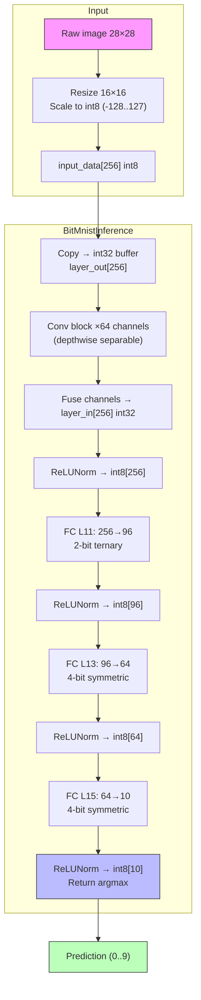
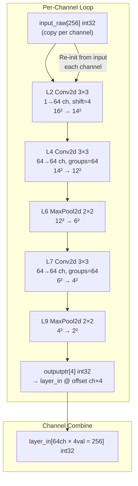
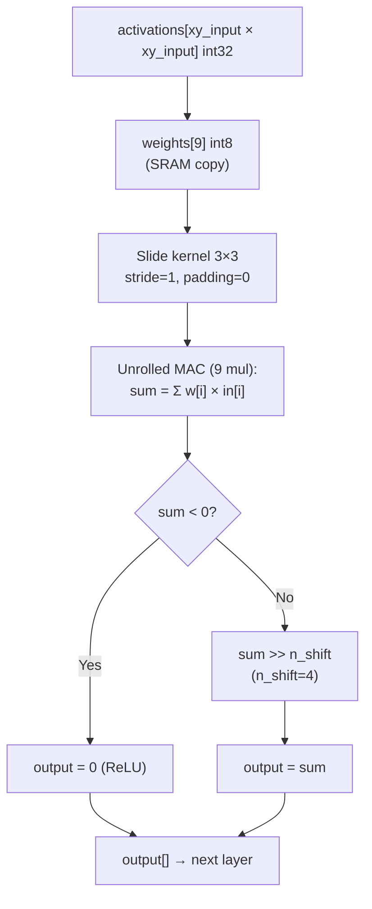
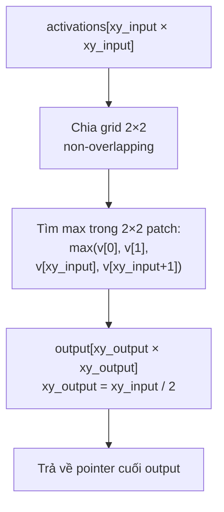
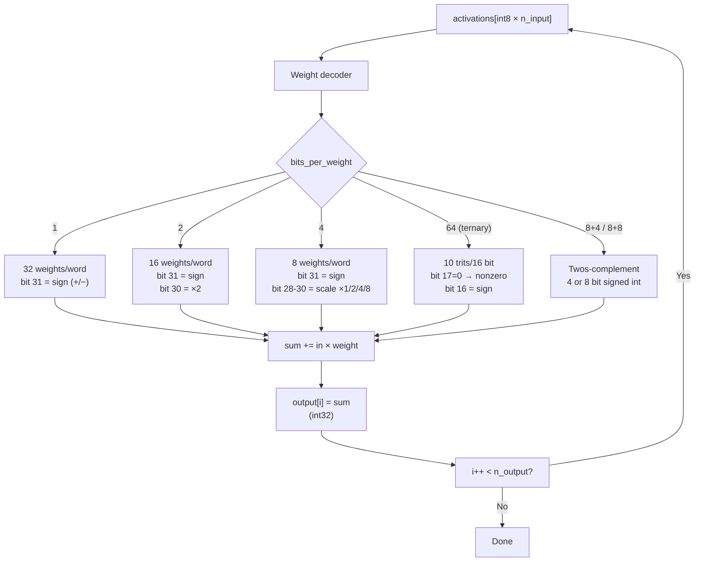
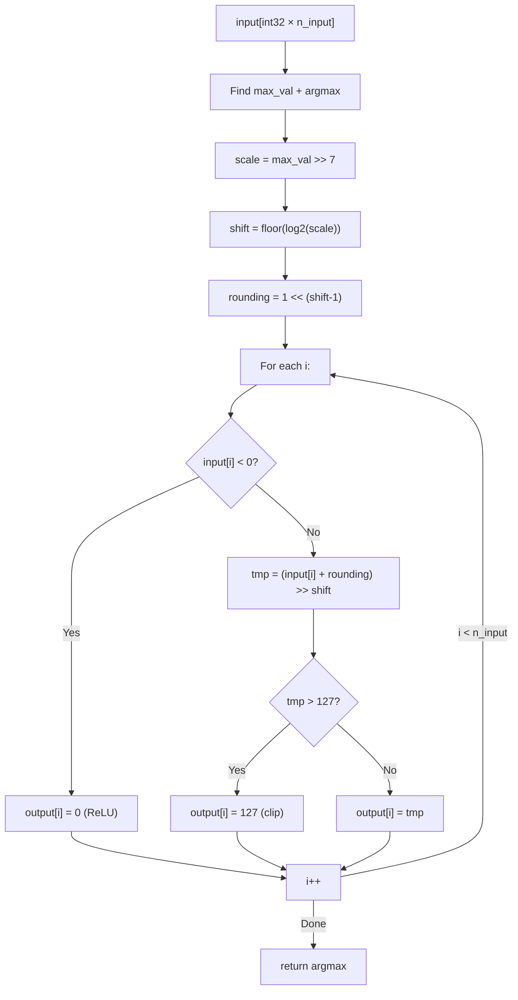
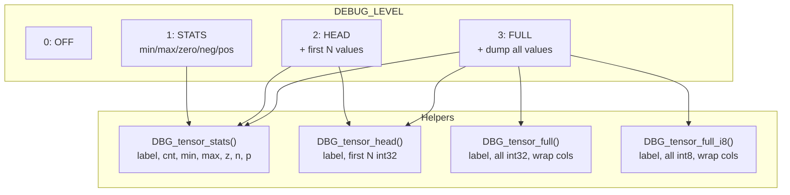

# BitNetMCU Inference Pipeline — CH32V003 (RISC-V, no HW MUL)

## 1. Tổng quan luồng dữ liệu

```
MNIST 28×28 → resize → 16×16 int8 → BitMnistInference() → prediction (0..9)
```



---

## 2. Chi tiết Conv block (depthwise separable)



**Depthwise separable** = mỗi channel conv độc lập (groups=64). 64 ch × 64 ch × 3×3 → 64 conv riêng, ko cross-channel.

---

## 3. processconv33ReLU — Conv2d 3×3 fused với ReLU



**Toán tử kernel (unrolled, ko loop con):**

```
sum  = w[0]*in[0]  + w[1]*in[1]  + w[2]*in[2]
     + w[3]*in[0+] + w[4]*in[1+] + w[5]*in[2+]
     + w[6]*in[0+] + w[7]*in[1+] + w[8]*in[2+]
                            ↑ xy_input stride
```

**Shift thay vì nhân:** `sum >> 4` giảm scale từ 8-bit weight × 8-bit activation → int32, xuống lại int32 phù hợp cho layer sau.

---

## 4. processmaxpool22 — MaxPool 2×2



**In-place OK** — output buffer có thể trùng input buffer.

---

## 5. processfclayer — Fully Connected (multi-bit)



### Chi tiết decoder cho từng loại weight:

| bpw | Tên | weights/word | Mỗi weight chiếm | Giá trị |
|---|---|---|---|---|
| 1 | Binary | 32 | 1 bit | 0 → +1, 1 → -1 |
| 2 | 2-bit symmetric | 16 | 2 bit | 00→0, 01→+1, 10→+2, 11→-1 |
| 4 | 4-bit symmetric (CH32V003) | 8 | 4 bit | sign + shift 0..3 → ±1/2/4/8 |
| 4 | 4-bit symmetric (generic) | 8 | 4 bit | sign + scale nibble → ±(1..15) |
| 64 | Ternary (10 trits) | — | 16 bit/10 weights | base3 encoding |
| 8+4 | 4-bit twos-complement | 8 | 4 bit | -8..7 |
| 8+8 | 8-bit twos-complement | 4 | 8 bit | -128..127 |

---

## 6. ReLUNorm — Normalization + ReLU



**Động:** shift phụ thuộc vào activation lớn nhất → scale range về [-127..127].

---

## 7. Ma trận layer đầy đủ (model test)

```mermaid
flowchart LR
    subgraph Input
        I["16×16 int8<br/>(256)"]
    end

    subgraph Conv
        L2["L2 Conv<br/>16²→14²<br/>8-bit weight"]
        L4["L4 Conv<br/>14²→12²<br/>8-bit weight"]
        L6["L6 Pool<br/>12²→6²"]
        L7["L7 Conv<br/>6²→4²<br/>8-bit weight"]
        L9["L9 Pool<br/>4²→2²"]
    end

    subgraph ConvOut
        CO["64ch × 4val<br/>= 256 int32"]
    end

    subgraph FC
        L11["L11 FC<br/>256→96<br/>2-bit ternary"]
        L13["L13 FC<br/>96→64<br/>4-bit sym"]
        L15["L15 FC<br/>64→10<br/>4-bit sym"]
    end

    subgraph Out
        O["argmax<br/>0..9"]
    end

    I -->|"×64 depthwise"| L2
    L2 --> L4
    L4 --> L6
    L6 --> L7
    L7 --> L9
    L9 --> CO
    CO -->|"ReLUNorm"| L11
    L11 -->|"ReLUNorm"| L13
    L13 -->|"ReLUNorm"| L15
    L15 -->|"ReLUNorm"| O

    style I fill:#e1d5e7
    style Conv fill:#dae8fc
    style FC fill:#d5e8d4
    style O fill:#ffcccc
```



### Tensor shape qua từng layer:

| Stage | Layer | Tensor shape | Phần tử | Loại |
|---|---|---|---|---|
| Input | — | 16×16 | 256 | int8 |
| L2 | Conv 3×3 | 14×14 | 196 | int32 |
| L4 | Conv 3×3 | 12×12 | 144 | int32 |
| L6 | MaxPool 2×2 | 6×6 | 36 | int32 |
| L7 | Conv 3×3 | 4×4 | 16 | int32 |
| L9 | MaxPool 2×2 | 2×2 | 4 | int32 |
| — | Stack 64ch | 64×2×2 | 256 | int32 |
| Norm | ReLUNorm | 256 | 256 | int8 |
| L11 | FC 256→96 | 96 | 96 | int32→int8 |
| L13 | FC 96→64 | 64 | 64 | int32→int8 |
| L15 | FC 64→10 | 10 | 10 | int32→int8 |

---

## 8. Debug logging system



**Output mẫu (DBG=1):**
```
[DBG] input_raw       cnt=256  min=-22   max=124   zero=0   neg=0   pos=0
[DBG] L2_conv         cnt=196  min=0     max=127   zero=32  neg=0   pos=164
[DBG] L4_conv         cnt=144  min=0     max=127   zero=28  neg=0   pos=116
[DBG] L6_pool         cnt=36   min=0     max=127   zero=4   neg=0   pos=32
[DBG] L7_conv         cnt=16   min=0     max=127   zero=2   neg=0   pos=14
[DBG] L9_pool         cnt=4    min=12    max=103   zero=0   neg=0   pos=4
[DBG] FC_in_after_norm cnt=256 min=0     max=127   zero=5   neg=0   pos=251
[DBG] L15_fc_out      cnt=10   min=-1    max=7     zero=0   neg=2   pos=8
[DBG] L15_norm_output cnt=10   min=0     max=127   zero=2   neg=0   pos=8
```

---

## 9. Tối ưu cho CH32V003 (RISC-V, ko MUL)

```
┌──────────────────────────────────────────────┐
│  CH32V003: RV32EC, 48 MHz, 2KB RAM, 16KB FLASH │
├──────────────────────────────────────────────┤
│  • processfclayer dùng shift thay multiply    │
│    sum += tmpsum<<1 (×2) thay vì sum += in*2 │
│  • Conv unrolled 3×3 — ko loop kernel         │
│  • MaxPool in-place — ko alloc thêm           │
│  • Weight packed bit — giảm flash              │
│  • int32 activation buffer — tránh overflow    │
│  • SRAM function attribute (comment out)       │
└──────────────────────────────────────────────┘
```

**processfclayer 4-bit (CH32V003 path):**
```c
// Không dùng multiply instruction
int32_t tmpsum = (weightChunk & 0x80000000) ? -in : in; // sign
sum += tmpsum;                                  // ×1
if (weightChunk & 0x10000000) sum += tmpsum<<1; // ×2
if (weightChunk & 0x20000000) sum += tmpsum<<2; // ×4
if (weightChunk & 0x40000000) sum += tmpsum<<3; // ×8
```

vs **generic path** (có MUL):
```c
int32_t tmpsum = (weightChunk & 0x80000000) ? -in : in;
sum += tmpsum;
sum += tmpsum * ((weightChunk>>(32-4-1))&0x0e); // dùng MUL
```
